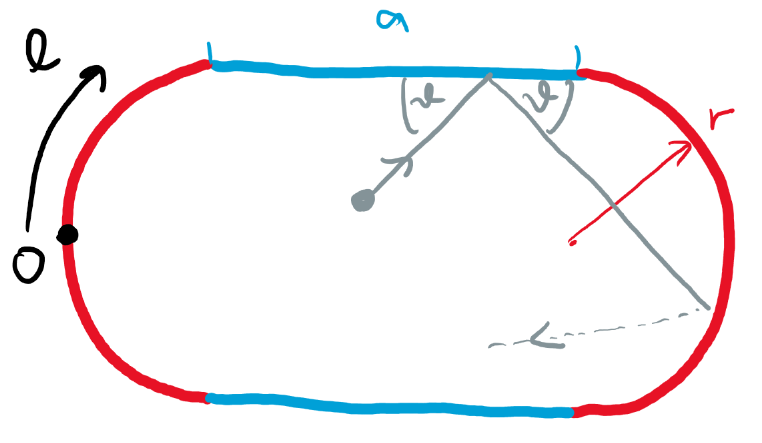

# Kulečník ve tvaru stadionu
Naprogramujte vývoj trajektorie bodové částice v kulečníku tvaru stadionu 

(rozpůlená kružnice o poloměru $r$, na obrázku červeně, nastavená obdélníkem délky $a$, na obrázku modře).

Částice se pohybuje bez tření rovnoměrně přímočaře, než narazí na stěnu kulečníku (část trajektorie je znázorněna šedě). Na ní se odrazí pod stejným úhlem $\theta$, pod kterým na ni nalétla.

1. Vypočítanou trajektorii vykreslete do grafu.
1. Trajektorii zobrazte následujícím jiným způsobem: pokaždé, když trajektorie narazí na stěnu, zakreslete do grafu bod o souřadnicích $(l,\theta)$, kde $l$ je vzdálenost po obvodu kulečníku od nějakého zvoleného počátečního bodu (např. tak, jak je na obrázku znázorněno černě).
2. Zvolte počáteční podmínku trajektorie a druhou trajektorii velmi blízkou vzdálenou o $\delta_{0}$, kde $\delta_{0}$ je o několik řádů menší než rozměry kulečníku. Napočítejte závislost odchylky na čase $\delta(t)$ do chvíle, než tato odchylka dosáhne velikosti srovnatelné s velikostí kulečníku. Získanou závislostí $\delta(t)$ proložte exponenciálu $$\delta(t)=\delta_{0} e^{\lambda t}$$ a určtete parametr $\lambda$. Tento parametr se nazývá Ljapunovovův exponent a udává stabilitu trajektorie. Pro přesnější výsledek opakujte pro daný tvar kulečníku s mnoha náhodně vybranými počátečními podmínkami pro trajektorii a získané Ljapunovovy koeficienty $\lambda$ zprůměrujte.

Uvažujte, že všechny částice v kulečníku se pohybují se stejnou rychlostí $v$. Poloměr kruhových stran $r$ volte fixní a měňte vzdálenost půlkruhů $a$.