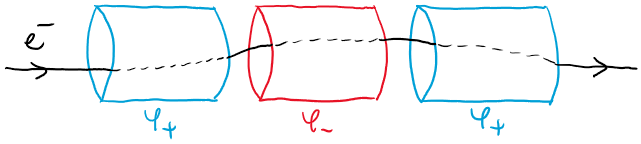
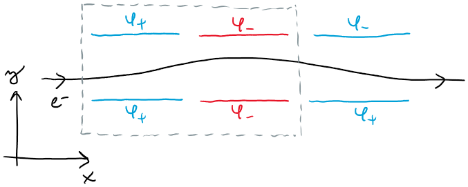

# Lineární urychlovač
Urychlovače v jaderné a částicové fyzice slouží ke kontrolovanému zvyšování energie nabitých částic, například elektronů, protonů, ale i iontů těžších prvků. Urychlené částice jsou pak sráženy buď mezi sebou, nebo narážejí na statický vzorek. Na základě výsledků srážek lze studovat mikroskopické vlastnosti vzorků a interakcí.

Nejjednodušší lineární urychlovač sestává z periodicky se střídajících vodivých válců s dvěma rozdílnými potenciály $\varphi_{+}>\varphi_{-}$:

Nabitá částice je eletrostatickou silou urychlena prvním segmentem urychlovače. Poté se elektrody přepoólují (tj. prohodí se potenciály $\varphi_{+}$ a $\varphi_{-}$) a částice je urychlována do druhého segmentu. Přepólováváni je i nadále sychronizováno s pohybem částice tak, aby vždy docházelo k urychlování. Uvnitř trubice je vakuum, aby nedocházelo ke ztrátám energie ze srážek se vzduchem.

Pro jednoduchost se omezte na dvourozměrný model:

1. Vyřešte dvourozměrnou Laplaceovu rovnici s *periodickou okrajovou podmínku* ve směru osy $x$ a spočítejte elektrostatický potenciál pro jeden segment urychlovače zobrazený na obrázku šedivým čárkovaným obdélníkem. Periodická okrajová podmínka v tomto případě simuluje nekonečně dlouhý urychlovač.
1. Spočítejte intenzitu elektrického pole $\overrightarrow{E}=-\nabla{\varphi}$ v každém bodě mříže, na které řešíte Laplaceovu rovnici.
1. Spočítejte a vykreslete trajektorii nabité částice, kterou do zařízení vystřelíte s počáteční rychlostí $\overrightarrow{v}^(0)=(v_{x}^{(0)},v_{y}^{(0)})$. Nezapomeňte ve vhodné okamžiky přepólovávat desky kondenzátoru.
1. Zakreslete závislost longitudinální rychlosti částice na čase $v_{x}(t)$.

Uvažujte jednotky $\epsilon_{0}=1$ (permitivita), $e=1$ (náboj urychlované částice). Vzdálenost mezi deskami (průměr urychlovače) volte $d=20$ jednotek, délku desek $l=50$ jednotek. Mezi deskami s kladným potenciálem $\varphi_{+}=+1$ a záporným potenciálem $\varphi_{+}=-1$ nechte mezeru alespoň 2 jednotky. Částici vpouštějte s počáteční podmínkou mimo osu urychlovače.

Více informací o urychlování nabitých částic najdete například [v prezentaci doc. Jiřího Dolejšího](http://ipnp.cz/~dolejsi/textbook/Accelerators_CZ.ppt).

*Volitelně:*
Rozšiřte kód i pro realističtější třírozměrný případ urychlovače s válcovými elektrodami zobrazený na prvním obrázku (řešení Laplaceovy rovnice ve válcových souřadnicích je naznačeno ve výše uvedené prezentaci).